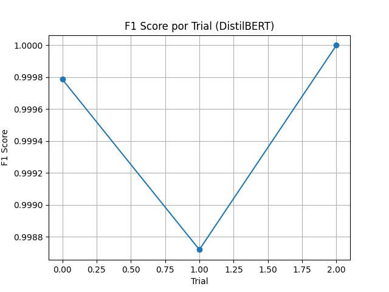

# 📰 Fake-News Detector with Transformer Models

This repository hosts a complete **Streamlit** application that classifies English-language news articles as **real (0)** or **fake (1)** using three fine-tuned transformer models (DistilBERT, BERT-base, ALBERT-base).  
The app also offers dataset exploration, basic Optuna tuning results and error analysis.

---

## 🚀 Live Demo  
👉 **<[https://fake-news-detector-ew6eylsn9cgfwsivjin4ce.streamlit.app/](https://fake-news-detector-ew6eylsn9cgfwsivjin4ce.streamlit.app/)>** &nbsp; 

---

## 📁 Repository  
👉 **<https://github.com/YOUR-USERNAME/fake-news-detector>**

---

## 🧠 Models

| Model        | Base checkpoint              | Params | Zip size |
|--------------|-----------------------------|--------|----------|
| DistilBERT   | `distilbert-base-uncased`   | 66 M   | 120 MB |
| BERT-base    | `bert-base-uncased`         | 110 M  | 420 MB |
| ALBERT-base  | `albert-base-v2`            | 12 M   | 55 MB |

Because of their size, the fine-tuned weights aren’t committed to GitHub.  
They’re stored on Google Drive and are downloaded / unzipped automatically the first time the app runs.

📦 **Download folder (models + train CSV)**  
👉 <[https://drive.google.com/drive/folders/1yxKA8RkMeU7PVfer-5eZ95Oqhm7qNKqn?usp=drive_link](https://drive.google.com/drive/folders/15H6J5pO-xqnMABSI2Mfb9P1kops6simH?hl=es-419)> &nbsp;

---

## 🖼️ App Pages

1. **Inference Interface**  
   * Paste headline + text, pick a model, get prediction & probabilities.

2. **Dataset Visualization**  
   * Class balance, word-count histogram, word cloud (from `train_dataset.csv`).

3. **Hyperparameter Tuning**  
   * Shows Optuna F1-curve (5 trials).  
   * No deep search was performed — DistilBERT reached 0.98 F1 with default LR 3e-5 / batch 8, so time was spent on analysis instead.
   * Only 5 Optuna trials were run—just enough to confirm a good learning-rate / batch-size pair without burning Colab hours.  
The figure below shows F1 over trials; the best configuration (trial 4) uses **lr 3 e-5, batch 8, 3 epochs**.

<p align="center">
  
</p>

4. **Model Analysis & Justification**  
   * Classification report, confusion matrix, error inspection.  
   * DistilBERT chosen for deployment (best F1, lowest latency & memory).

---

## 🧪 Quick test inputs

Copy **Title** and **Content** into the app to check predictions.

| Case | Scenario | Expected |
|------|----------|----------|
| 1 | EU green-hydrogen deal (formal) | Real |
| 2 | “Apple-seed cure cancer” click-bait | Fake |
| 3 | NASA pizza order on Mars (satire) | Fake |

<details>
<summary>Show text snippets</summary>

**Case 1 – Real**  
*Title:* EU Signs \$50 Billion Green-Hydrogen Deal With Morocco  
*Content:* Brussels — … European Commission confirmed on Monday … first shipments 2027 …

---

**Case 2 – Fake**  
*Title:* Scientists Reveal Apple-Seed Extract CURES Stage-4 Cancer in 10 Days!  
*Content:* New York — … no peer-reviewed data … \$100 million bribe …

---

**Case 3 – Satire**  
*Title:* NASA Admits Mars Rover Ordered 12 000 Pizzas on Agency Credit Card  
*Content:* Houston — … negotiating a \$87 billion interplanetary delivery fee …
</details>

---

## 🛠️ Local installation

```bash
git clone https://github.com/YOUR-USERNAME/fake-news-detector.git
cd fake-news-detector

# (optional) create env
python -m venv .venv
source .venv/bin/activate  # Windows: .venv\Scripts\activate

pip install -r requirements.txt
streamlit run streamlit_app.py ``` 


## 🙌 Built With

- 🤗 Hugging Face Transformers  
- 🔥 PyTorch  
- 🧼 Streamlit  
- 📊 Scikit-learn  
- 📈 Seaborn, Plotly, Matplotlib  
- 💻 Google Colab Pro (for training)


